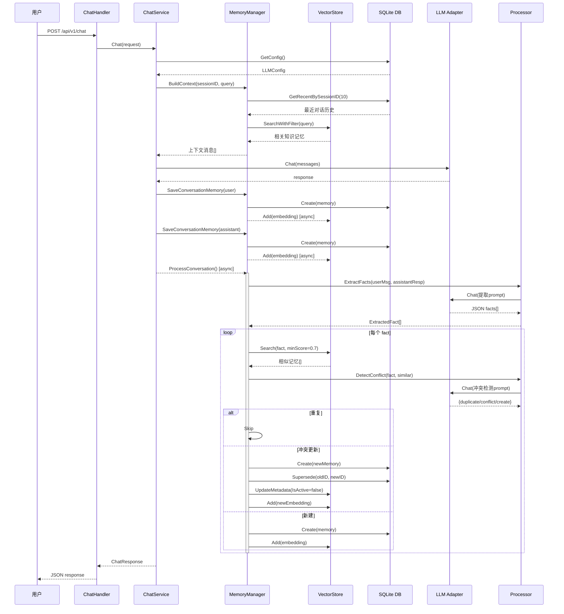
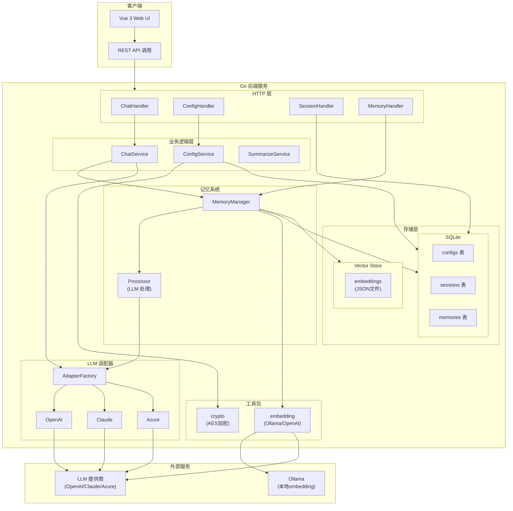
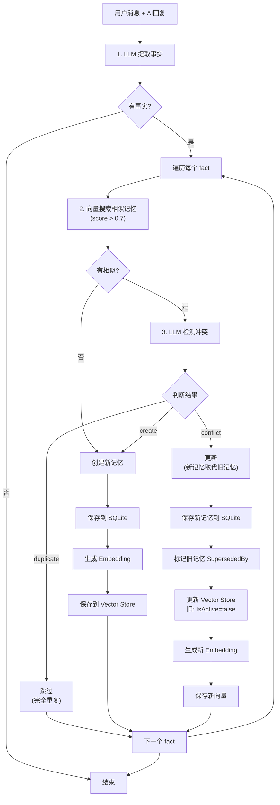
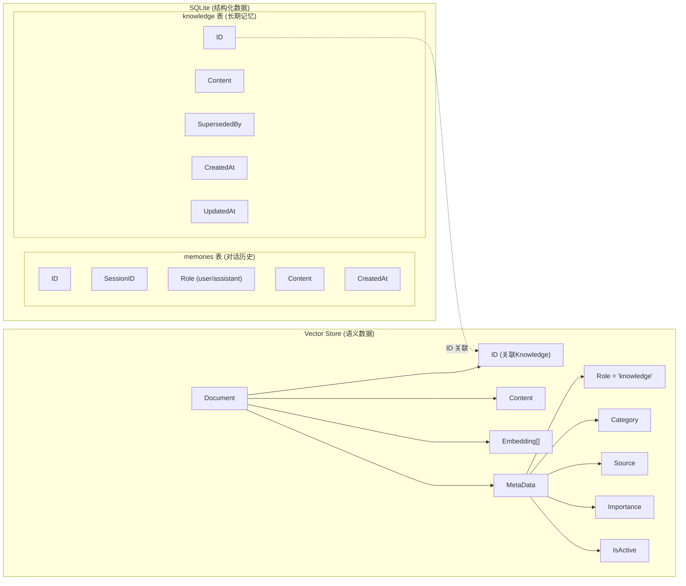

# LLM Agent 架构文档

## 时序图 - 聊天请求流程



## 流程图 - 系统架构



## 数据流程图 - 记忆写入



## 存储结构对比



### 数据分离说明

| 存储 | memories 表 | knowledge 表 | Vector Store |
|------|-------------|--------------|--------------|
| 用途 | 对话历史 | 长期知识 | 语义搜索 |
| 范围 | 会话级别 | 全局 | 全局 |
| 生命周期 | 短期 | 长期 | 长期 |
| 冲突检测 | 无 | 有 (SupersededBy) | 有 (IsActive) |
| 语义搜索 | 不支持 | 通过Vector Store | 支持 |

## 目录结构

```
.
├── cmd/server/main.go          # 入口，依赖注入
├── internal/
│   ├── adapter/                # LLM 适配器
│   │   ├── adapter.go          # 接口定义
│   │   ├── openai.go
│   │   ├── claude.go
│   │   └── azure.go
│   ├── handler/                # HTTP 处理器
│   ├── service/                # 业务逻辑
│   │   ├── chat_service.go
│   │   ├── config_service.go
│   │   └── memory_service.go
│   ├── repository/             # 数据访问
│   │   ├── memory_repo.go      # 对话历史存储
│   │   └── knowledge_repo.go   # 知识存储
│   ├── model/                  # 数据模型
│   │   ├── memory.go           # Memory (对话)
│   │   └── knowledge.go        # Knowledge (知识)
│   └── pkg/
│       ├── memory/             # 记忆管理
│       │   ├── manager.go      # MemoryManager (统一入口)
│       │   ├── processor.go    # LLM 提取与冲突检测
│       │   └── types.go        # 类型定义
│       ├── vector/             # 向量存储
│       ├── embedding/          # Embedding 提供商
│       └── crypto/             # 加密工具
├── web/                        # Vue 3 前端
├── data/
│   ├── llm.db                  # SQLite (memories + knowledge 表)
│   └── chroma/vectors.json     # 向量存储 (只存知识)
└── configs/config.yaml         # 配置文件
```
